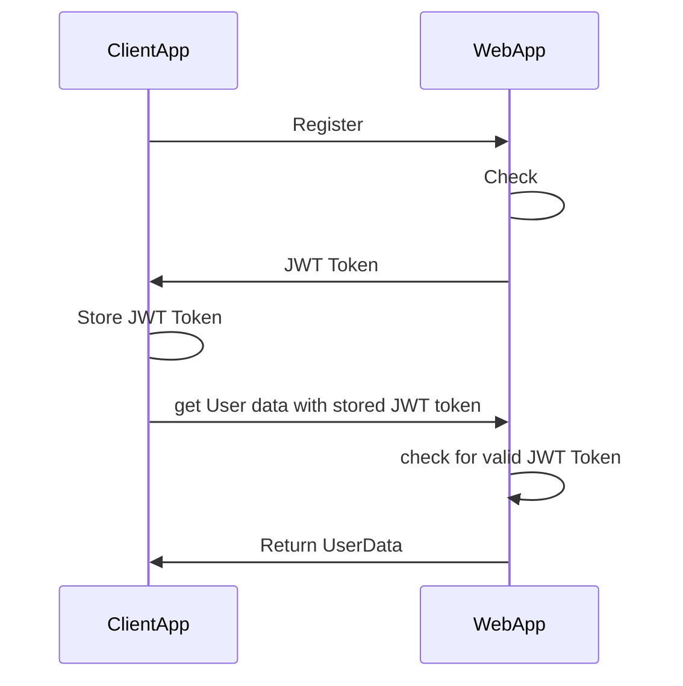

```mermaid
sequenceDiagram
    participant ClientApp
    participant WebApp
    ClientApp->>WebApp: Register
    WebApp->WebApp: Check
    WebApp->>ClientApp: JWT Token
    ClientApp->ClientApp: Store JWT Token

    ClientApp->>WebApp: get User data with stored JWT token
    WebApp->>WebApp: check for valid JWT Token

    WebApp->>ClientApp: Return UserData
```
